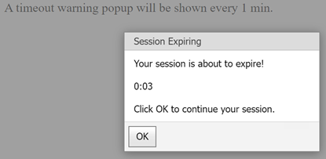

<!-- default badges list -->

<!-- default badges end -->

# Popup Control for ASP.NET Web Forms - How to control state when the Session is being expired and prolong it on demand

This example shows how to display a warning message before a user's session times out, and how to either allow the user to continue the session or log them out automatically.

For more information, refer to the following blog posts:

- [ASP.NET WebForms Blog Post](http://community.devexpress.com/blogs/aspnet/archive/2011/06/15/asp-net-how-to-show-a-popup-warning-before-session-timeout.aspx)
- [ASP.NET MVC Blog Post](http://community.devexpress.com/blogs/aspnet/archive/2011/07/11/asp-net-mvc-how-to-show-a-popup-warning-before-session-timeout-aspnetmvc.aspx)

<!-- default file list -->
## Files to Look At

* **[Default.aspx](./CS/WebApp/Default.aspx#L13) (VB: [Default.aspx](./VB/WebApp/Default.aspx#L13))**
* [Default.aspx.cs](./CS/WebApp/Default.aspx.cs) (VB: [Default.aspx.vb](./VB/WebApp/Default.aspx.vb))
* [TimeoutControl.ascx](./CS/WebApp/TimeoutControl.ascx) (VB: [TimeoutControl.ascx](./VB/WebApp/TimeoutControl.ascx))
* [TimeoutControl.ascx.cs](./CS/WebApp/TimeoutControl.ascx.cs) (VB: [TimeoutControl.ascx.vb](./VB/WebApp/TimeoutControl.ascx.vb))
* [TimeOutPage.aspx](./CS/WebApp/TimeOutPage.aspx) (VB: [TimeOutPage.aspx](./VB/WebApp/TimeOutPage.aspx))
<!-- default file list end -->

## Documentation

- [ASPxPopupControl](https://docs.devexpress.com/AspNet/DevExpress.Web.ASPxPopupControl)

## More Examples

- [Popup Control for ASP.NET Web Forms - How to show a pop-up window](https://github.com/DevExpress-Examples/web-forms-show-popup-window)
- [Popup Control for ASP.NET Web Forms - How to add buttons to a pop-up window](https://github.com/DevExpress-Examples/asp-net-web-forms-popup-add-buttons-to-popup-window)
<!-- feedback -->
## Does this example address your development requirements/objectives?

 

(you will be redirected to DevExpress.com to submit your response)
<!-- feedback end -->
